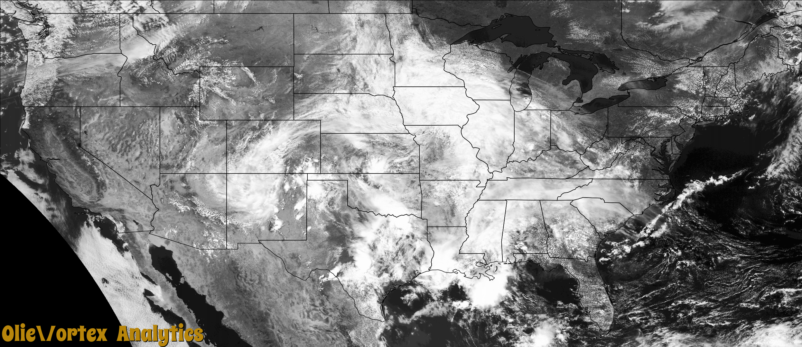

# olievortex_purple
Convert a NetCDF satellite image file to png format.

This project was part of a larger back-end system. It dequeued messages from an Azure Service Bus. It then shells out to a different Python script for processing. This was to ensure minimal memory usage.

The shelled script then reads metadata from Cosmos DB. Next, the source file is downloaded from Azure Blob Storage. The image file is then generated. Next, the image is uploaded to Azure Blob Storage. Finally, the Cosmos DB is updated to make the image live on the website.

The source satellite files are obtained from the [Registry of Open Data on AWS](https://registry.opendata.aws/noaa-goes/).

Run the olievortex_demo.py script to generate the image file. A sample file is included in the sample_files folder. A 'resample_cache' folder is created to cache the mapping from the NetCDF grid to the PNG grid. This significantly speeds up subsequent execution times.

